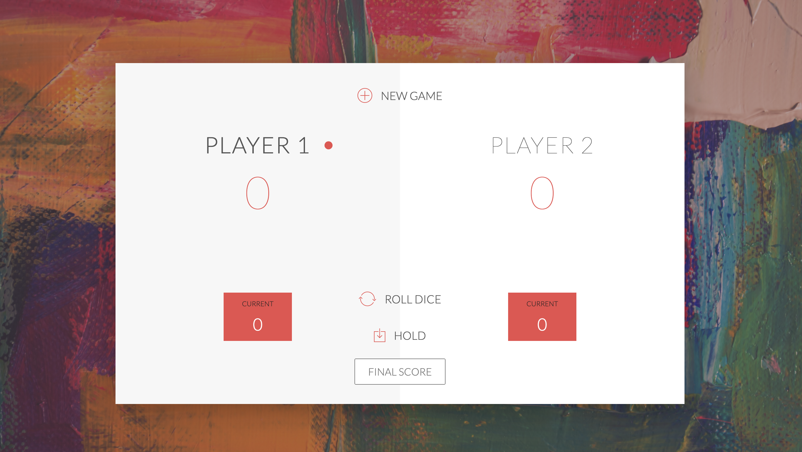

# Pig-Game



Part of the [Complete JavaScript Course](https://www.udemy.com/course/the-complete-javascript-course/) I completed, this project put JavaScript concepts from the section on DOM manipulation and events into practice.

## Clone 
- Clone this repo to your local machine using ```https://github.com/fgsumer/Pig-Game.git```


#### GAME RULES:

- The game has 2 players, playing in rounds
- In each turn, a player rolls a dice as many times as he whishes. Each result get added to his ROUND score
- BUT, if the player rolls a 1, all his ROUND score gets lost. After that, it's the next player's turn
- if the player rolls a 6 two times in row, all his ROUND score gets lost. After that, it's the next player's turn
- The player can choose to 'Hold', which means that his ROUND score gets added to his GLBAL score. After that, it's the next player's turn
- The first player to reach 100 points on GLOBAL score wins the game but you can decide the final score, as well.
